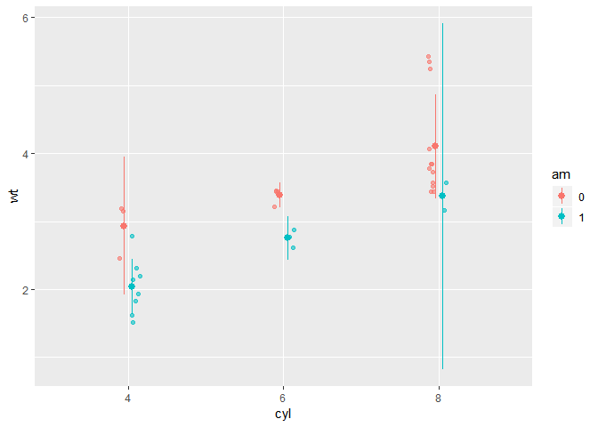
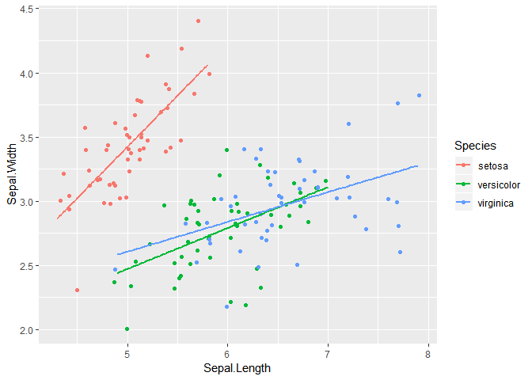

``` r
library(ggplot2)
library(tidyverse)
library(Hmisc)  #for Stat_Summary
library(RColorBrewer)
library(GGally)
library(nycflights13)
```

Stats outside Geoms
===================

Use stat\_summary function in Hmisc package.

``` r
mtcars <- mtcars %>%
  mutate(cyl = as.factor(cyl), 
         am = as.factor(am))

# Set the position
posn.d <- position_dodge(width = 0.1)
posn.jd <- position_jitterdodge(jitter.width = 0.1, dodge.width = 0.2)
posn.j <- position_jitter(0.2)

# base layer
wt.cyl.am <- ggplot(mtcars, aes(x = cyl, y = wt, col = am, fill = am, group = am)) 
```

``` r
wt.cyl.am +
  geom_point(position = posn.jd, alpha = 0.6) +
  stat_summary(fun.data = mean_sdl, fun.args = list(mult = 1), position = posn.d)
```

 Plot
mean and Standard Deviation

``` r
wt.cyl.am +
  geom_point(position = posn.jd, alpha = 0.6) +
  stat_summary(fun.data = mean_sdl, fun.args = list(mult = 1), position = posn.d) +
  stat_summary(fun.data = mean_cl_normal, position = posn.d)
```

 two
stat\_summary function. one for mean and the other for 95% CI

``` r
wt.cyl.am +
  stat_summary(geom = "point", fun.y = mean,
               position = posn.d) +
  stat_summary(geom = "errorbar", fun.data = mean_sdl,
               position = posn.d, fun.args = list(mult = 1), width = 0.1)
```


Remove points and add mean and error bar.

``` r
xx <- 1:100

gg_range <- function(x) {
  data.frame(ymin = min(x), # Min
             ymax = max(x)) # Max
}

med_IQR <- function(x) {
  data.frame(y = median(x), # Median
             ymin = quantile(x)[2], # 1st quartile
             ymax = quantile(x)[4])  # 3rd quartile
}
```

``` r
wt.cyl.am <- ggplot(mtcars, aes(x = cyl,y = wt, col = am, fill = am, group = am))

wt.cyl.am +
  stat_summary(geom = "linerange", fun.data = med_IQR,
               position = posn.d, size = 3) +
  stat_summary(geom = "linerange", fun.data = gg_range,
               position = posn.d, size = 3,
               alpha = 0.4) +
  stat_summary(geom = "point", fun.y = median,
               position = posn.d, size = 3,
               col = "black", shape = "X")
```


first stat\_summary is for 1st / 3rd quantile

Second stat\_summary is for min / max

Third stat\_summary is for median

Coordinates and Facets
======================

``` r
p <- ggplot(mtcars, aes(x = wt, y = hp, col = am)) + geom_point() + geom_smooth()

p + coord_cartesian(xlim = c(3, 6))
```

    ## `geom_smooth()` using method = 'loess' and formula 'y ~ x'


``` r
base.plot <- ggplot(iris, aes(x = Sepal.Length, y = Sepal.Width, col = Species)) +
               geom_jitter() +
               geom_smooth(method = "lm", se = FALSE)
par(mfrow = c(1, 2))
base.plot
```



``` r
base.plot + coord_equal()
```


coord\_equal for aspect ratio.

Pie Chart
=========

``` r
wide.bar <- ggplot(mtcars, aes(x = 1, fill = cyl)) +
              geom_bar()

wide.bar +
  coord_polar(theta = "y") +
  theme_void() # Clean up the background
```


wide.bar is the plot that contains count of cyl. The thickness of the
plot is the number of car which have cyl = 4 / 6 / 8. coord\_polar is
change the visual cue (thickness into angle)

``` r
ggplot(mtcars, aes(x = 1, fill = cyl)) +
  geom_bar(width = 0.1) +
  scale_x_continuous(limits = c(0.5, 1.5)) +
  coord_polar(theta = "y")
```


scale\_x\_continuous : limit the width of bar chart.

``` r
ggplot(mtcars, aes(x = factor(cyl), fill = factor(am))) +
  geom_bar(position = "fill", width = 1) +
  facet_grid(. ~ cyl) + # Facets
  coord_polar(theta = "y") + # Coordinates
  theme_void() # theme
```


``` r
mtcars %>%
  mutate(am = factor(am)) %>%
ggparcoord(c(1:8,10,11), groupColumn = 9, alpha = 0.8) 
```


am is 9th column of mtcars. ggparcoord : plotting static parallel
coordinate plots.

``` r
mtcars$cyl_am <- paste(mtcars$cyl, mtcars$am, sep = "_")
myCol <- rbind(brewer.pal(9, "Blues")[c(3,6,8)],
               brewer.pal(9, "Reds")[c(3,6,8)])

ggplot(mtcars, aes(x = wt, y = mpg, col = cyl_am, size = disp)) +
  geom_point() +
  scale_color_manual(values = myCol) +
  facet_grid(gear ~ vs)
```


scale\_color\_manual : specify the color of the points.

theme
=====

``` r
theme(plot.background = element_rect(fill = myPink, color = "black", size = 3))
```

: Change background color to pink(“\#FEE0D2”)  
Change Background to blackline and width = 3

``` r
theme(text = element_text()
      title = ...
      plot.title = ...
      legend.text = ...
      legend.title = ...
      axis.title = ...
      axis.title.x = ...
      axis.title.y = ...
      axis.text = ...
      axis.text.x = ...
      axis.text.y = ...
      strip.text = ...
      strip.text.x = ...
      strip.text.y = ...
      )
```

theme for text.

``` r
theme(line = element_line()
      axis.ticks = ...
      axis.ticks.x = ...
      axis.ticks.y = ...
      axis.line = ...
      axis.line.x = ...
      axis.line.y = ...
      panel.grid = ...
      panel.grid.major = ...
      panel.grid.minor = ...
      panel.grid.major.x = ...)
```

theme for line.

``` r
theme(rect = element_rect()
      legend.background = ...
      legend.key = ...
      panel.background = ...
      panel.border = ...
      plot.background = ...
      strip.background = ...)
```

theme for rectangle.

``` r
theme(strip.text = element_text(size = 16, color = myRed),
        axis.title = element_text(color = myRed, hjust = 0, face = "italic"),
        axis.text = element_text(color = "black"))
```

: Modify the theme

-   argument of themes

1.  legend.postion = “bottom” / “none”

2.  legend.direction = “horizontal”

3.  panel.spacing.x = unit(2, “cm”)

4.  plot.margin = unit(c(1, 2, 1, 1), “cm”)

``` r
theme <- theme_tufte() +
  theme(legend.position = c(1, 1))
theme_set(theme)
```

Before draw the plot, specify the theme by theme\_set

``` r
m <- ggplot(mtcars, aes(x = cyl,y = wt, col = am, fill = am))
posn.d <- position_dodge(0.9)

m +
  stat_summary(fun.y = mean, geom = "bar", position = posn.d) +
  stat_summary(fun.data = mean_sdl, fun.args = list(mult = 1), geom = "errorbar", width = 0.1, position = posn.d)
```


bar plot with mean and standard error.

Heatmap
=======

``` r
# Create color palette
myColors <- brewer.pal(9, "Reds")

# Build the heat map from scratch
ggplot(barley, aes(x = year, y = variety, fill = yield)) +
  geom_tile() + # Geom layer
  facet_wrap( ~ site, ncol = 1) + 
  scale_fill_gradientn(colors = myColors) # Adjust colors
```


Use scale\_fill\_gradientn, Not scale\_fill\_gradient.
scael\_fill\_gradient has error in continuous\_scale

ribbon Plot
===========

``` r
ggplot(barley, aes(x = year, y = yield, col = site, group = site, fill = site)) +
stat_summary(fun.y = mean, geom = "line") +
stat_summary(fun.data = mean_sdl, fun.args = list(mult = 1), geom = "ribbon", col = NA, alpha = 0.1)
```


line and its sd ribbon.

Waffle Chart
============

``` r
cyl_perc <- mtcars %>%
  group_by(cyl) %>%
  summarise(percent = n()/nrow(mtcars) * 100) %>% .$percent

names(cyl_perc) <- c(4, 6, 8)

waffle::waffle(cyl_perc)
```


Stacked bars
============

``` r
flights %>%
  mutate(month = month.abb[month]) %>%
  group_by(month, origin) %>%
  summarise(n = n()) %>%
  mutate(n = as.numeric(n)) %>%
  ggplot(aes(x = month, y = n, fill = origin)) +
  geom_col(position = "fill")
```


